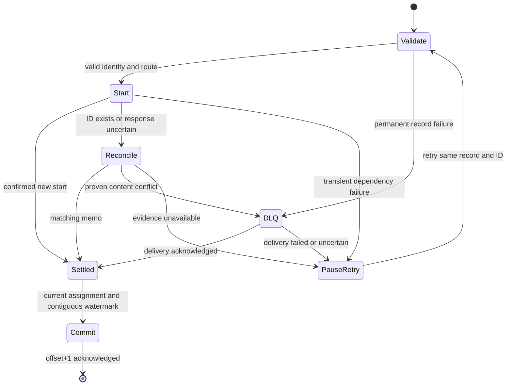

# Implementation Plan: Temporal Enterprise Workflow Core

Feature: `001-enterprise-workflow-platform` | Date: 2026-10-01  
Spec: [spec.md](spec.md) | Constitution: [../../.specify/memory/constitution.md](../../.specify/memory/constitution.md)

## Summary

Implement the major capabilities of one Python application: secure shared clients and
configuration; deterministic Workflow/Activity execution; authorized retry-safe HTTP
ingestion; reliable Kafka ingestion; operational telemetry; and production deployment.
Use one immutable image with `APP_ROLE=INGESTION|WORKER`. The initial Workflow publishes
one acknowledged Kafka event and returns its receipt. Supporting design documents and
machine-readable contracts are part of this plan, not additional independently deployed
services. No application implementation has been generated by this package.

## Technical Context

| Concern | Decision |
|---|---|
| Runtime | Python 3.11 minimum; initially qualify one pinned Python 3.12 patch on Linux |
| Temporal | Python SDK candidate `temporalio==1.34.0`; F02/T001 starts the staged API/compatibility qualification |
| API/config | FastAPI, Uvicorn, Pydantic v2 and pydantic-settings, compatible versions locked with hashes |
| Kafka | Confluent Python client/librdkafka; managed blocking poll threads with bounded async bridges |
| Crypto | cryptography AESGCM; versioned mounted JSON keyring; external KMS/secret unwrapping boundary |
| Identity | JWT verifier supporting configured asymmetric OIDC algorithms; bounded JWKS cache; no local user store |
| Canonicalization | RFC 8785 compatible canonical JSON for cross-transport duplicate comparisons |
| Telemetry | structlog JSON, prometheus-client, supported Temporal OpenTelemetry integration and OTLP exporter |
| Persistence | Temporal histories and Kafka offsets; no additional application database |
| Test tools | pytest/pytest-asyncio, Temporal WorkflowEnvironment/Replayer, real Kafka/Temporal integration |
| Deployment | One Dockerfile; Helm chart for Kubernetes resources, KEDA and optional ServiceMonitor |
| Platform dependencies | Temporal/Kafka/OIDC/TLS/secret manager/Prometheus/OTLP provisioned separately |

F02/T001 verifies client/TLS names, signatures and wheel availability; F03 verifies
converter/replay APIs, F11 the Runtime/telemetry APIs and F15 real Worker versioning APIs.
Verify each API before using it. The original global task outline is reference only.
Candidate versions are researched pins, not a claim that an unbuilt application is
compatible. Record resolved dependency versions, image digest, Temporal
Service/CLI versions and KEDA/Kubernetes capabilities in `docs/compatibility.md`. Prefer
supported stable APIs; do not adopt preview features as required foundation behavior.

## Constitution Check

| Principle | Design compliance | Release evidence |
|---|---|---|
| One application/two roles | Shared image and internal packages; external infrastructure | V-023, V-030 |
| Durable/honest delivery | Manual commits, shared ID policy, Activity dedup contract | V-009, V-012–V-020 |
| Security boundaries | Full-Payload codec, protected failures, tenant namespace isolation | V-002–V-008, V-024 |
| Bounded operability | Explicit limits, critical-task supervision, probes/drain | V-001, V-016, V-022, V-026 |
| Contracts first | API/event/routing contracts and traceable tasks | V-008–V-011, V-030 |
| Evidence/small tasks | Tests per behavior, replay/security/capacity release gates | V-019–V-030 |

No principle exceptions are currently proposed. Re-evaluate this table before release.

## Project Structure

The current repository stores the specification. Generate the following application at
the repository root when implementing; its project/package identity is
`temporal-enterprise-framework`. Do not add a redundant nested project directory.

```text
/
├── .specify/memory/constitution.md
├── specs/001-enterprise-workflow-platform/
├── app/
│   ├── __init__.py
│   ├── api/
│   │   ├── main.py             # app construction and authorized routes
│   │   ├── models.py           # HTTP request/response contracts
│   │   ├── auth.py             # OIDC verification and scope/tenant checks
│   │   └── health.py           # both-role probes and app metrics router
│   ├── events/
│   │   ├── models.py           # event/DLQ validation
│   │   ├── consumer.py         # partition state machine and asyncio coordinator
│   │   ├── bridge.py           # broker-owned threads, bounded handoff queues
│   │   └── producer.py         # confirmed-delivery producer abstraction
│   ├── temporal/
│   │   ├── activities/system_activities.py
│   │   ├── workflows/enterprise_event_workflow.py
│   │   ├── client/__init__.py
│   │   ├── client/builder.py   # configured client pool, not client.py beside package
│   │   ├── client/start_service.py
│   │   ├── worker/__init__.py
│   │   ├── worker/factory.py   # EnterpriseWorker, not worker.py beside package
│   │   ├── models.py           # typed durable inputs/results
│   │   ├── registry.py         # static approved workflows and activity bindings
│   │   ├── converter.py
│   │   └── interceptors.py
│   ├── config/settings.py
│   ├── config/routing.py
│   ├── config/credentials.py
│   ├── config/key_provider.py
│   ├── observability.py
│   └── main.py                # python -m app.main
├── tests/{unit,workflow,integration,replay,load}/
├── tests/fixtures/histories/   # synthetic encrypted histories only
├── deploy/helm/temporal-enterprise-framework/
├── config/routing.example.yaml
├── docs/{compatibility,runbooks,dashboards}/
├── scripts/{local-stack,verify-contracts,qualify}/
├── .github/workflows/ci.yml
├── Dockerfile
├── .dockerignore
├── pyproject.toml
├── requirements.in
├── requirements.txt          # exact resolved versions and hashes
├── requirements-dev.txt
└── README.md
```

Every Python package receives an `__init__.py`. Workflow imports remain isolated from
settings, network clients, logging initialization and codec code. Infrastructure fixtures
are test dependencies, not a third application role.

## Capability 1 — Validated configuration and trusted boundaries

Settings load once before resources are opened. Use typed enums, constrained integers,
`SecretStr` where applicable and mounted files. Never dump `model_dump()` unredacted.
Validation checks syntactic config, file accessibility, key lengths, TLS presence and route
consistency; dependency preflight checks are bounded separately.

| Setting | Default / constraint |
|---|---|
| APP_ROLE | Required `INGESTION` or `WORKER` |
| APP_ENV | `production`; explicit `local` or `test` needed for insecure fixtures |
| TEMPORAL_URL | Required `host:port`; one endpoint per process, no URL credentials |
| TEMPORAL_NAMESPACE | WORKER selection; INGESTION namespace list comes from routes |
| MTLS_CERT_PATH / MTLS_KEY_PATH / MTLS_CA_PATH | Required readable mounted files in production |
| CREDENTIAL_PROFILES_PATH | Path-only Temporal/Kafka profile mapping to mounted secrets; required for multiple profiles |
| TEMPORAL_TLS_SERVER_NAME | Configured verified identity override when required; never disable checking |
| ENCRYPTION_KEYRING_PATH | Required key-provider snapshot; active ID + retained 32-byte AES keys |
| KMS_ENCRYPTION_KEY | Deprecated base64 32-byte test/local alias; forbid in production |
| ROUTING_CONFIG_PATH | Required validated versioned route file |
| WORKER_TASK_QUEUES | Required WORKER selection, 1–4 approved queues in selected namespace |
| MAX_NAMESPACE_CLIENTS | 16 maximum default; finite explicit increase requires qualification |
| KAFKA_BROKERS / KAFKA_GROUP_ID | Broker list required; group alias only for single-binding fixtures; production groups from routes |
| KAFKA_SECURITY_PROTOCOL | Production `SASL_SSL` or `SSL`; fixtures may explicitly use PLAINTEXT |
| KAFKA_SASL_USERNAME / KAFKA_SASL_PASSWORD_FILE | Conditional mounted credentials; no plaintext env password |
| KAFKA_SASL_MECHANISM | Explicit allowed mechanism, initially SCRAM-SHA-512 |
| KAFKA_CA_PATH / KAFKA_CERT_PATH / KAFKA_KEY_PATH | Trust required; client cert/key when using broker mTLS |
| KAFKA_TRIGGER_TOPICS / KAFKA_DLQ_TOPIC | Single-binding aliases; production topics from selected bindings; no implicit topic creation |
| KAFKA_MAX_CONSUMER_BINDINGS | 16 selected bindings maximum; each group/profile owns one poll thread |
| OIDC_ISSUER / OIDC_AUDIENCE / OIDC_JWKS_URL | Required ingestion; HTTPS trusted configured URLs |
| OIDC_ALLOWED_ALGORITHMS | Explicit asymmetric allowlist, default RS256; never token-selected algorithm |
| OIDC_JWKS_CACHE_TTL_SECONDS | 300; bounded max 32 keys, refresh timeout2s, fail closed after expiry |
| HTTP_PORT / SDK_METRICS_PORT | 8080 both roles / 9090 WORKER only |
| START_RPC_TIMEOUT_SECONDS | 5; reconciliation separate bounded5s budget, no unlimited retries in HTTP |
| READ_RPC_TIMEOUT_SECONDS | 3 including describe/optional completed result fetch budget |
| MAX_REQUEST_BYTES / MAX_EVENT_BYTES | 262144 (256 KiB), enforced before full allocation where possible |
| MAX_JSON_DEPTH / MAX_ENCODED_PAYLOAD_BYTES | 32 / 524288 (512 KiB), per serialized Payload including envelope |
| API_MAX_IN_FLIGHT | 128 per pod; excess returns429 with Retry-After |
| API_RATE_PER_TENANT_PER_SECOND / API_RATE_BURST | 50 / 100 per pod; bounded16 tenant buckets, ingress owns aggregate limits |
| KAFKA_MAX_IN_FLIGHT / KAFKA_BUFFER_RECORDS | 32 / 256; at most one unresolved record per partition |
| KAFKA_MAX_POLL_INTERVAL_MS | 300000; poll thread continues at <=100ms configured interval |
| WORKER_MAX_CONCURRENT_WORKFLOW_TASKS | 32 total process budget, allocated across selected queues |
| WORKER_MAX_CONCURRENT_ACTIVITIES | 64 total process budget; shared producer waits64 |
| ACTIVITY_EXECUTOR_MAX_WORKERS | 32 for registered sync Activities; factory rejects sync registration without executor |
| WORKER_MAX_CACHED_WORKFLOWS | 1000 total process budget, allocated across selected queues |
| GRACEFUL_SHUTDOWN_SECONDS / PROCESS_SHUTDOWN_DEADLINE_SECONDS | Worker drain90s / hard process exit110s; Kubernetes grace>=120s |
| OTEL_EXPORTER_OTLP_ENDPOINT / LOG_LEVEL | Private configured endpoint / INFO with no payload logging |
| WORKER_DEPLOYMENT_NAME / WORKER_BUILD_ID | Stable deployment identity / immutable image build identity |
| WORKER_VERSIONING_MODE | Production `PINNED`; approved `COMPATIBLE_ROLLING` requires documented capability exception |

These are conservative starting bounds, not universal capacity settings. Requirements
for a role are conditional: Worker does not require OIDC; ingestion does not instantiate
Workers or bind the SDK metrics port. Validate mutually incompatible settings (for example
WorkerTuner and fixed concurrency options) before creating a Worker.

Routes are config-driven, never computed directly from untrusted strings. The gateway can
hold bounded clients for authorized tenant namespaces at one endpoint. Each Worker pod
selects one namespace and finite queue set; its namespace-specific credential can have
narrower access than gateway credentials. Role deployments mount distinct secrets.

## Capability 2 — Payload protection and standardized clients

Follow [security.md](security.md) and [research.md](research.md). Implement an asynchronous
`PayloadCodec` mapping sequences of Payloads to sequences, encrypting the serialized whole
Payload protobuf so original metadata survives decryption. Use AES-256-GCM, random 96-bit
nonces, untruncated tags and authenticated version/key/namespace envelope metadata.
The codec may perform secret-provider I/O outside Workflow code, but v1 snapshots keys at
startup; no remote KMS round-trip per Workflow task. Production has no plaintext fallback.

Construct the DataConverter using the chosen typed serialization converter, encrypted
codec and common-attributes FailureConverter. Error type strings are safe allowlisted
codes. Validate converters on both gateway and Worker and with encrypted-history Replayer.
Headers contain safe trace metadata only; Search Attributes and routing IDs are plaintext
and must never hold business data. No public codec server is built.

Create one client pool per process/event loop, keyed by namespace, credential profile and
immutable startup certificate snapshot.
Read cert/key/CA mounts,
build verified TLS config and attach the same converter, supported trace interceptor and
process Runtime. Initialize Runtime once before clients, with SDK exporter only in Worker
role; `Worker` does not receive a fabricated `prometheus_port` argument. Log the redacted
build/namespace identity once, never certificate contents. Keep pool initialization atomic
so concurrent requests do not construct inconsistent clients. Cleanup follows supported
SDK lifecycle APIs; do not invent a `Client.close()` if the pinned SDK has no such API.

## Capability 3 — Durable execution and Worker factory

`EnterpriseWorker` accepts approved Workflow/Activity registrations and queue selection,
uses the configured client and process Runtime, and owns Worker shutdown and any sync
Activity executor. Build one Worker per selected queue; all share one namespace client.
Use fixed task/cache limits initially and supported poller autoscaling when verified by
F02 compatibility checks; choose a single concurrency model. Allocate per-queue SDK limits
so sums remain within 32 Workflow tasks,64 Activities and 1000 cached Workflows per process;
do not multiply each default by four queues. Producer pending waits64 and sync executor32
are shared process bounds. Register no dynamic arbitrary Workflow executor.

The reference Workflow input is `{intent: StartIntent, execution_route: RouteSnapshot}`,
containing immutable namespace/queue/output-topic/revision plus canonical business
payload, ID and validated safe correlation context. It deterministically builds a stable
`publish_id=<workflow_id>:publish:0`, calls `publish_event`, and returns the receipt. Apply
PINNED versioning behavior when supported. Validate input outside start and inside the
Activity; do not initialize Pydantic settings or broker clients inside Workflow imports.

Reference publish Activity options:

| Option | Baseline |
|---|---|
| start_to_close_timeout | 30 seconds per attempt |
| schedule_to_close_timeout | 120 seconds total including retry/scheduling |
| heartbeat_timeout | 10 seconds |
| retry_policy | initial1s, multiplier2, maximum10s, maximum_attempts5 |
| non_retryable_error_types | approved ValidationError, UnauthorizedRoute, PayloadTooLarge |
| heartbeat interval | <=2s while waiting; subject to SDK throttle and 10s timeout |
| cancellation handling | Observe heartbeat/cancellation, cancel local waiting, re-raise cancellation |

Producer resources are injected into Activities at Worker startup, not recreated for each
attempt. The producer thread services callbacks and reports delivery futures to asyncio;
enqueue is not success. Bounded BufferError handling retries within the attempt deadline.
Use `acks=all` and `enable.idempotence=true`; broker ACL/config supplies required durability.
Do not use a Kafka transaction to imply atomicity with Temporal. On lost completion a
second Activity attempt may publish again; stable publish ID is the downstream dedup key.

Future authoring guidance documents Temporal time/random APIs, safe import pass-through,
schema changes, patching, compensation when needed and Continue-As-New for growing histories.
The finite reference Workflow requires no Continue-As-New loop or bespoke base class.
Unexpected Python exceptions generally fail a Workflow Task and leave execution retrying;
use intentional safe ApplicationError for terminal business rejection. Do not configure
all Exception subclasses as Workflow-terminal merely to make tests finish. Decode-before-run
errors need bounded task-failure diagnostics rather than an infinite result wait.

## Capability 4 — Shared start service and REST gateway

Both transports call a single `start_service` after validation and authorization. Create
the canonical request digest according to [data-model.md](data-model.md); transport trace
or Kafka offset changes do not change business identity. Set Workflow ID to the UUID,
open-conflict FAIL and closed-reuse REJECT_DUPLICATE. Set bounded RPC deadlines and encrypted
memo with identity digest and immutable route binding. Start never awaits completion.

Outcomes are `started`, `duplicate`, `conflict`, `retryable_unknown` or `permanent_invalid`.
Catch only known SDK exceptions. Already-started and ambiguous outcomes lead to bounded
describe/reconciliation of encrypted memo. Never return duplicate solely because an ID
exists. If memo proves changed content/route, return conflict. If transport/decoding/key
availability prevents verification, retain retryability and alert. Do not retry a changed
request automatically. A duplicate run may have any terminal state; it is not restarted.

FastAPI routes follow [contracts/openapi.yaml](contracts/openapi.yaml). Require a caller
generated UUID idempotency key; a lost response can then be retried safely. OIDC validation
checks configured algorithm, issuer, audience, expiration/not-before, key and required
scopes/tenant grants, without token-controlled network fetch. Bounded JWKS refresh on an
unknown key ID cannot become an amplification path. Strip secrets from exception output.

Status resolves namespace from authorized tenant/domain, describes with optional run ID,
checks memo identity and returns safe status. Without a run ID follow the latest run of
the execution chain using supported handle semantics; with it bind to that run. Fetch a
result only after status COMPLETED and `include_result=true`, under the remaining read
budget. Failed/canceled/terminated/timed-out executions return safe terminal metadata.
Apply `Cache-Control: no-store`, request IDs, admission limits and aggregate ingress policy.

## Capability 5 — Reliable Kafka ingress

Use `enable.auto.commit=false` and `enable.auto.offset.store=false`. Each selected consumer
binding (maximum16) has one dedicated thread owning that group's consumer operations,
polling regularly and servicing control commands. Credentials resolve through the
path-only profile mapping; source tenant identity is bound to the approved input topic.
Async coordinators never call blocking `Consumer.poll/commit/close` on the event loop.
One unresolved start/DLQ outcome is allowed per partition; across partitions use a bounded
semaphore and finite handoff queue, with limits shared across all bindings in the process.
When saturated pause assignments while still polling;
do not silently discard callback records or advance offsets. Control and rebalance commands
must retain capacity even when the data buffer is full.



Use backoff initial1s, maximum30s and jitter; retain retries until dependency recovery,
with bounded memory and alert thresholds. Infrastructure credential/namespace outages
pause ingestion; they are not record errors. On revocation, fence the assignment epoch,
commit only previously settled eligible watermark within the callback budget, release
unstarted records and let new owners reconcile uncertain starts. An already transmitted
start may succeed after revocation, but the old owner must not commit it. Commit failures
never authorize skipping earlier offsets. DLQ records exclude original bodies and raw
exceptions; their deterministic source-coordinate ID tolerates repeat delivery.

## Capability 6 — Telemetry and lifecycle

Initialize JSON logging and bounded metric registries once. Custom Activity interceptors
bind/reset context and measure wall duration outside Workflow code. Workflow interceptors
use replay-aware SDK logging/trace facilities and deterministic APIs only; Workflow logical
duration differs from wall-clock task execution latency. Never add Workflow ID, run ID,
trace ID, message ID, offsets or unbounded exception text as Prometheus labels.

App metrics and probes use port8080 for both roles. Worker SDK metrics use a second private
port9090 configured on Runtime; Prometheus scrapes both. HTTP endpoints in Worker role are
only operational endpoints. Metric labels use finite role/route/workflow/outcome/reason
enumerations. Traces carry validated W3C trace context through Kafka headers/envelope and
safe Temporal headers, and exclude baggage/business payloads. Reset context after every
record/request/Activity so concurrency cannot leak correlation fields.

The role supervisor owns the HTTP server and critical tasks in one observed TaskGroup.
Ingestion starts shared resources in FastAPI lifespan and enables readiness only after
client/broker preflight; it does not use a detached background consumer. Worker supervises
probe server plus Worker.run tasks and producer bridge. Fatal exceptions cancel siblings,
drain/close resources and exit nonzero. Dependency outages mark readiness false and retry
without liveness restart storms. SIGTERM first sets not-ready, stops intake/polling new
tasks and targets drain within 90s. Remaining cleanup/forced cancellation has a hard110s
process deadline; platform grants120s and interrupted work recovers through Temporal.

## Capability 7 — Deployment, scaling and safe releases

Follow [operations.md](operations.md). Docker uses a pinned slim runtime/base digest,
multi-stage dependency build as appropriate, non-root UID, read-only root filesystem and
explicit entrypoint `python -m app.main`. Helm generates separate role Deployments from
the same image digest, private Services, optional ServiceMonitors, PDBs, NetworkPolicies,
TLS/secret mounts and values schemas. Default `serviceAccount.automount=false`; add only
required identity permissions. Secrets are references to operator-provisioned resources,
not templated private keys or committed defaults.

INGESTION scaling combines Kafka consumer lag and REST demand under one KEDA ScaledObject.
Kafka-driven useful consumers are bounded by partitions; REST-driven replicas may exceed
partitions only with explicit idle-consumer policy. WORKER scaling uses validated SDK
scheduling-delay/capacity metrics for each queue/namespace, with min 2 replicas. Do not scale
Workers from trigger-topic lag, which drops immediately after Workflow starts. Document
Prometheus stale/no-data behavior and floor/manual fallback. With min 2, scale-down
stabilization controls reduction; KEDA cooldown is primarily the scale-to-zero mechanism.

Prefer supported Worker Deployment Versions with immutable image identity and PINNED
Workflows. Each build has a distinct Kubernetes Worker Deployment or Helm release whose
name includes immutable build identity; old and new deployments coexist. Do not Helm-upgrade
the old worker Deployment to the new image. Rolling replacement applies to ingestion,
same-build credential restarts or the explicit compatible-rolling exception. Old versions
remain available for their pinned runs. Operators promote/ramp and
roll back versions through external Temporal release controls; no third admin service is
built. A compatible rolling mode is allowed only with an approved capability exception,
patch-compatible code and successful replay of relevant histories. Promotion never follows
from readiness alone. Key and cert changes use documented rolling restart procedures.

## Capability 8 — Verification and AI delivery

Implement the feature-local tasks in [roadmap.md](roadmap.md) order; [tasks.md](tasks.md)
indexes that canonical backlog. Tests live beside the feature they verify.
[verification.md](verification.md) defines V-001–V-030 and
release gates. Unit tests cover contracts and bounded state machines; WorkflowEnvironment
tests use synthetic Activities/time skipping; real-service tests cover TLS, encryption
history, Kafka commits/producer callbacks and failure windows. Time skipping does not prove
real broker/network/timing behavior. Encrypted replay uses matching converter, namespace
scope, registrations and historical keys. Load tests use real clocks/services.

Evidence includes JUnit/coverage as useful, contract validation, replay report, image/SBOM,
rendered manifests, observed drain/recovery events, load distribution and dashboards.
Blocked integration prerequisites are reported explicitly; tests cannot be marked passed
because mocks succeeded. Do not issue production deployment, version promotion, secret
rotation or destructive history cleanup as part of ordinary code generation.

## Complexity Tracking and risks

| Risk | Mitigation and release gate |
|---|---|
| No transaction across Kafka/Temporal | At-least-once commit fence and retained-ID reconciliation; V-012–V-015 |
| Retention-limited dedup | Explicit replay/retention invariant and runbook; V-009, V-027 |
| Arbitrary payload/metadata leakage | Strict schemas, protected failures and raw-history tests; V-002–V-005 |
| Multiple tenant namespaces | Bounded route/client pool and mounted credential least privilege; V-008 |
| Ingestion role combines HTTP+Kafka | Single lifecycle supervisor, independent scaling demands; V-022, V-025 |
| SDK/API/versioning drift | Staged F02/F03/F11/F15 API qualification, replay/real-server tests; V-020, V-028 |
| Key loss/early deletion | Active/retained read keys, restore inventory and rotation gate; V-004, V-029 |
| Side-effect duplication | Stable publish IDs and downstream dedup contract; V-017 |
| Capacity depends on external quotas | Measured qualification profile and bounded configuration; V-026 |

No extra persistence or services are justified by the initial capability set. Any later
requirement for indefinite deduplication, object storage or multi-region failover must
amend scope rather than quietly expand this implementation.
